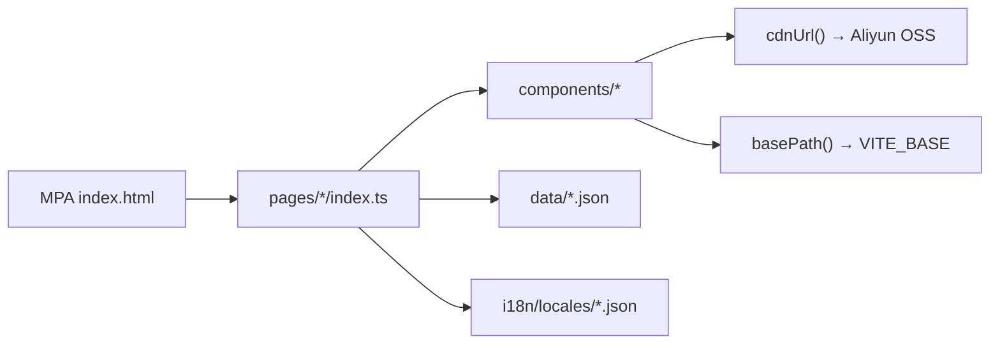

# System Patterns（架构与关键决策）

## Production deployment update (2026-07-20)

Production is now an Ubuntu 24.04 host accessed through the local SSH alias `web-server`. Nginx serves the Vite build from `/var/www/corp/dist` at `/`, using `try_files $uri $uri/ /index.html`. The local `scripts/deploy.ps1` and `scripts/deploy.sh` build, replace that directory, upload the new `dist`, normalize `www-data` permissions, validate/reload Nginx, and check local HTTP. Server-side backups are temporarily disabled; rollback requires redeploying a retained local or CI build artifact. See ADR-0007.

> 系统怎么搭起来的、为什么这么搭。重点是模式与决策，而非逐行实现。

## 架构总览

每个页面有独立 `index.html` 入口，由对应 `pages/*/index.ts` 在浏览器端渲染；全局布局（Navbar、Footer、ScrollToTop）通过 `mountLayout` / `initPage` 挂载。About 下可有子页（如 `/about/certifications/`、`/about/clients/`），在 `vite.config.ts` 的 `rollupOptions.input` 注册。

## 首页信息流（2026-07-05）

Hero → HeroIntro → Solutions → CapabilityRing → CaseCarousel → ProductGrid → ServiceStrip → About。桌面端各屏高度按 `100dvh - navbar` 比例约束（见 `--home-screen-*` CSS 变量与 `home-screen--*` class）。

## 关键技术决策

| 决策 | 选择 | 理由 | 关联 ADR |
|------|------|------|----------|
| 前端架构 | Vite MPA + TypeScript DOM | Phase 1 快速交付，无框架开销 | `decisions/0001-vite-mpa-phase1.md` |
| 图片 | 阿里云 OSS CDN | 减小 repo 体积，集中管理 | `decisions/0002-aliyun-oss-cdn.md` |
| 国际化 | 自研轻量 i18n + `_zh`/`_ru` 后缀 | 零依赖，JSON 字段回退英文 | `decisions/0003-self-built-i18n.md` |
| 子路径部署 | `basePath()` + `VITE_BASE` | Nginx 多版本对比预览 | `decisions/0004-basepath-subpath-deploy.md` |
| 主题 | 运行时 CSS 变量切换（3 accent） | v2/v3 皮肤实验合并为运行时方案 | `decisions/0005-runtime-theme-switching.md` |
| 生产部署 | 阿里云 ECS + Nginx 路径 `/` | 与同机 `/insoles`、`/api` 隔离 | `decisions/0006-aliyun-ecs-nginx-deploy.md` |
| 列表内容 | JSON 驱动渲染 | 增内容不改页面结构 | — |

## 核心设计模式 / 约定

- 列表型内容（案例、产品、FAQ）**必须**来自 JSON，禁止写死在 HTML
- 图片统一通过 `cdnUrl(category, filename)` 引用，不写死 OSS URL
- **图片资源工作流**（素材不进 repo，仅 `ignored/` + OSS）：
  1. 原图放入 `ignored/resources_png/`（含甲方实拍与 AI 生成图，按类别子目录）
  2. 用 `ignored/libwebp/` 脚本（`convert_to_webp.py` / `trim_images.py`）生成 WebP → `ignored/resources/`
  3. 将 `ignored/resources/` 上传至阿里云 OSS（`resources/` 前缀）
  4. 有增删改时，同步更新 `frontend/src/data/image-resources.json`（CDN URL → originalPath + description）
- OSS 图片类别（随素材增减）：`hero` · `scene` · `products` · `projects` · `company` · `company-info` · `certifications` · `capacity`
- 站内链接统一通过 `basePath('/xxx/')` 生成，支持子路径部署
- UI 文案在 `i18n/locales/*.json`；结构化内容多语言字段用 `_zh` / `_ru` 后缀，缺省回退英文
- 组件按功能分目录（`navbar/`、`hero-carousel/` 等），页面逻辑在 `pages/*/`

## 关键实现路径

页面启动 → `initPage()` → `mountLayout`（Navbar + Footer + ScrollToTop）→ 页面 `render*()` 读 JSON → `td()` 取 i18n → `cdnUrl()` 取图 → `basePath()` 生成链接

## 已知的坑 / 约束

- JSON 中不可使用 `import.meta.env`；链接须在 TS 层用 `basePath()` 动态拼接
- 高德 Key / securityJsCode 不得提交 Git，使用 Vite 环境变量
- nginx `sub_filter` / Referer 重定向方案对 JS 动态链接无效，已废弃（见 ADR-0004）
- Phase 1 **禁止**提前引入 React/Vue/Astro/CMS/自建后端
